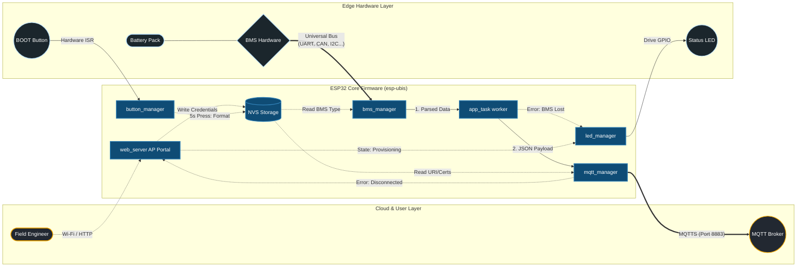

# esp-ubis-firmware: Universal Battery Interface System (UBIS)

## Project Introduction

The **esp-ubis-firmware** represents an advanced, industrial-grade, and **mission-critical** embedded software solution for ESP32 microcontrollers. Engineered on the robust **ESP-IDF v5.x framework**, this firmware is designed for **high-reliability** Battery Management System (BMS) telemetry, secure system configuration, and **fault-tolerant** data ingestion via TLS-encrypted MQTT. It provides comprehensive functionalities for interfacing with diverse BMS protocols, acquiring critical battery parameters, and securely dispatching them to a remote server. A key feature is its intuitive embedded web-based provisioning portal, enabling seamless and secure field deployment and configuration.

This project showcases expertise in:
*   **Real-time Operating Systems (RTOS)**: Proficient use of FreeRTOS for task management, inter-task communication (mutexes, event groups), and robust concurrency.
*   **Modular Software Design**: Implementation of a component-based architecture and design patterns like the Strategy Pattern for maintainability and extensibility.
*   **Secure Communication**: Deep understanding and implementation of MQTTS (MQTT over TLS) with certificate-based authentication.
*   **Non-Volatile Storage (NVS)**: Secure and persistent storage of critical configuration parameters.
*   **Web Server Development**: Development of an embedded HTTP server for device provisioning and configuration in Access Point (AP) mode.
*   **Hardware Interfacing**: Direct interaction with UART and GPIO peripherals for BMS communication and user interaction.

## Key Features & Technologies Utilized

*   **ESP-IDF v5.x**: The official IoT Development Framework for ESP32, providing a rich set of APIs and FreeRTOS integration.
*   **FreeRTOS**: Employed for concurrent task execution, thread-safe resource management (mutexes), software timers, and interrupt handling.
*   **Polymorphic BMS Driver Architecture (Strategy Pattern)**: Enables dynamic selection and integration of different BMS communication protocols (e.g., JBD, Daly) at runtime, enhancing flexibility and maintainability.
*   **MQTTS (MQTT over TLS)**: Secure telemetry data dispatch using TLS v1.2+, ensuring data integrity, confidentiality, and server authentication via X.509 certificates.
*   **Embedded Web Provisioning Portal**: A lightweight HTTP server (`esp_http_server`) serving a responsive `index.html` frontend in AP mode, facilitating secure initial setup and configuration of Wi-Fi and MQTT parameters.
*   **Non-Volatile Storage (NVS)**: Utilized for persistent storage of critical configuration data (Wi-Fi credentials, MQTT broker URI, BMS type) across reboots.
*   **Hardware Interrupts (ISR)**: For responsive handling of physical button presses, enabling critical functions like factory reset via long-press detection.
*   **UART Communication**: Dedicated for reliable, low-level serial communication with BMS units.
*   **GPIO Management**: For controlling status LEDs and monitoring physical buttons.

### System Architecture Data Flow



#### Diagram Legend

| Line Type | Arrow Symbol | Description & Behavior |
| :--- | :---: | :--- |
| **Primary Data Flow** | ───▶ | Standard, continuous operational logic (e.g., passing structs, JSON packing). |
| **Secure / Hard Link** | ═══▶ | Physical hardware signals (UART, GPIO) or TLS 1.2+ Encrypted Network Traffic. |
| **Config & Fallback** | - - -▶ | Configuration reads/writes to NVS, or system falling back to AP mode upon errors. |

### Modular Component-Based Structure
The project adheres to a modular component-based architecture, characteristic of well-structured ESP-IDF projects. Each core functionality is encapsulated within its own `components/` subdirectory, promoting high cohesion, low coupling, reusability, and ease of maintenance. This structure is crucial for managing complexity in industrial-grade embedded systems.

The main application logic resides in `main/`, orchestrating the initialization and interaction of various custom components:

*   **`main/`**: The system's entry point (`app_main`) responsible for the sequential and safeguarded initialization of all subsystems. This includes NVS, network interfaces, web provisioning portal, secure MQTT client, BMS driver layer, application worker tasks, hardware button manager, and status LED manager.
*   **`components/app_task/`**: Implements the primary application background worker. This FreeRTOS task is responsible for orchestrating periodic telemetry acquisition from the BMS and securely publishing this data via the MQTT client.
*   **`components/bms_interface/`**: Defines the abstract interface (`bms_driver_t`) for all BMS drivers, ensuring a standardized API for polymorphic behavior. This component embodies the "interface segregation" principle, crucial for the Strategy Pattern.
*   **`components/bms_manager/`**: The core of the BMS driver strategy. It selects and manages the active BMS driver at runtime based on NVS configuration, delegating operations like `init` and `read_data` to the concrete driver.
*   **`components/bms_driver_jbd/` & `components/bms_driver_daly/`**: Concrete implementations of the `bms_interface` for JBD (Xiaoxiang) and Daly BMS protocols, respectively. They handle the low-level UART communication and protocol-specific data parsing.
*   **`components/button_manager/`**: Manages the hardware BOOT button, detecting long-press events via an ISR and a FreeRTOS software timer to trigger a factory reset safely.
*   **`components/led_manager/`**: Provides thread-safe control over the status LED using FreeRTOS mutexes to indicate various operational states without race conditions.
*   **`components/mqtt_manager/`**: Encapsulates the secure MQTTS client functionality, including TLS setup, certificate management, secure connection handling, and telemetry publishing.
*   **`components/network_manager/`**: Manages Wi-Fi connectivity, supporting both Station (STA) mode for connecting to existing networks and Access Point (AP) mode for provisioning. It dynamically switches modes based on NVS settings.
*   **`components/nvs_manager/`**: A wrapper around ESP-IDF's Non-Volatile Storage (NVS) API, providing a simplified and robust interface for reading and writing persistent configuration data.
*   **`components/web_server/`**: Implements the embedded HTTP server to host the web provisioning portal (`frontend/index.html`), allowing users to configure network and MQTT settings. It includes robust URL-decoding logic for secure parameter parsing.

### FreeRTOS Concurrency Model
The firmware extensively utilizes the FreeRTOS real-time operating system to ensure **deterministic execution**, **responsiveness**, and **efficient resource management** across all critical functions. This multi-threaded approach prevents blocking operations from impacting system responsiveness. Key elements of this concurrency model include:

*   **Tasks**: Dedicated FreeRTOS tasks (e.g., `app_task`, `led_task`, `wifi_test_task`) manage distinct functionalities, ensuring independent execution and clear separation of concerns. Task priorities are carefully assigned to meet real-time requirements.
*   **Mutexes**: `led_manager` utilizes FreeRTOS mutexes (`s_led_mutex`) to protect shared resources (like the `s_current_mode` variable) during state transitions, preventing **race conditions** and ensuring **thread safety**. This is critical for reliable status indication.
*   **Software Timers**: The `button_manager` employs a FreeRTOS software timer (`s_button_timer`) to accurately measure the duration of button presses. This allows for the reliable detection of long-press events (e.g., 5+ seconds) without busy-waiting.
*   **Interrupt Service Routines (ISRs)**: The `button_manager` leverages GPIO ISRs for immediate detection of physical button events (rising/falling edges). This ensures **low-latency response** to user input, crucial for activating critical functions like factory reset.
*   **Event Groups**: The `network_manager` uses FreeRTOS Event Groups (`wifi_event_group`) to synchronize Wi-Fi connection states between different tasks, allowing tasks to wait for specific network events (e.g., `WIFI_CONNECTED_BIT`, `WIFI_FAIL_BIT`) without polling.

### Polymorphic BMS Interface (Strategy Pattern)
The esp-ubis-firmware incorporates a highly extensible and polymorphic BMS driver architecture, a prime example of the **Strategy Pattern**. This design allows for seamless integration and **runtime selection** of different BMS communication protocols without requiring firmware recompilation or re-flashing. This greatly enhances the system's adaptability to varying hardware.

*   **`bms_interface` (Interface Definition)**: This component defines a clear, abstract interface (`bms_driver_t`) comprising function pointers for common BMS operations (`init`, `read_data`). This struct acts as a virtual table, enabling polymorphism in C.
*   **Concrete Strategy Implementations (`bms_driver_jbd`, `bms_driver_daly`)**: Each specific BMS protocol (e.g., JBD, Daly) provides its own implementation of the `bms_driver_t` interface. These drivers encapsulate the unique low-level communication specifics (e.g., UART commands, response parsing).
*   **`bms_manager` (Context/Client)**: This component acts as the "context" in the Strategy Pattern. It holds a pointer to the currently active `bms_driver_t` and delegates BMS operations to it. The `bms_manager_init()` function dynamically selects the appropriate driver at system startup by reading the `bms_type` from NVS. This dynamic selection makes the system highly configurable and flexible.

## Security Model

The security framework of the esp-ubis-firmware is meticulously designed for **mission-critical deployments**, prioritizing **secure communication** and **robust credential handling**.

*   **MQTTS (MQTT over TLS)**: All operational telemetry data is dispatched over MQTTS (MQTT Secure), employing **TLS v1.2+ (Transport Layer Security)** on the standard port 8883. This cryptographic protocol ensures:
    *   **Data Integrity**: Protection against unauthorized alteration of data during transit.
    *   **Confidentiality**: Encryption of telemetry payloads, preventing eavesdropping.
    *   **Authenticity**: Verification of both the client (implicitly, via known client ID/credentials) and the server (explicitly, via certificates) to prevent impersonation.
*   **Embedded Root CA Certificate**: A trusted **Root CA certificate (`ca.crt`)** is securely embedded directly into the firmware within the `components/mqtt_manager/` directory. This certificate is *fundamental* for the ESP32 client to authenticate the MQTT broker during the TLS handshake. It establishes a cryptographically secure and **trusted communication channel**, verifying that the client is connecting to a legitimate server and not a malicious intermediary.
*   **Strict Common Name (CN) Verification**: The TLS implementation strictly enforces verification of the **Common Name (CN)** presented in the MQTT broker's server certificate against the configured broker URI. This critical security measure actively **mitigates man-in-the-middle (MITM) attacks** and guarantees that the device only establishes connections with validated and authorized servers. It is a deliberate design choice that the firmware **does not incorporate any logic to bypass or skip common name checking**, thereby upholding the highest security standards.

## Hardware Interfaces

### UART (BMS Communication)
The primary interface for Battery Management System communication (utilized by `bms_driver_jbd` and `bms_driver_daly`) adheres to the following parameters:

*   **UART Peripheral**: `UART_NUM_1` (ESP32's second hardware UART peripheral).
*   **UART Transmit (TX) Pin**: `GPIO 17`.
*   **UART Receive (RX) Pin**: `GPIO 16`.
*   **Baud Rate**: `9600` bps.
*   **Data Format**: 8 data bits, no parity, 1 stop bit (8N1).
This configuration ensures reliable, low-level serial data exchange with the connected BMS units.

### GPIO (User Interaction & Status Indication)

*   **Status LED**: Connected to `GPIO 2`. This LED is robustly managed by the `led_manager` component to provide clear visual feedback on the system's operational states, including provisioning mode, network connection status, and error conditions. Its behavior is critical for field diagnostics.
*   **BOOT Button**: Connected to `GPIO 0` (the standard "BOOT" button on most ESP32 development boards). Monitored by the `button_manager` for user-initiated actions. A continuous press event of 5 seconds or longer triggers a **factory reset** of all sensitive network and MQTT credentials stored in NVS, followed by an autonomous system reboot into AP provisioning mode. This serves as a vital **fail-safe mechanism** for field resets.

## Deployment & Provisioning Guide

This section provides a comprehensive, step-by-step guide for deploying and provisioning the esp-ubis-firmware in an industrial environment, ensuring secure and reliable operation.

### 1. CA Certificate Injection (Critical Security Step)

For any production deployment, the default `components/mqtt_manager/ca.crt` file **must be replaced** with the **Root CA certificate** issued by your specific MQTT broker's Certificate Authority. This embedded certificate is **non-negotiable** for establishing secure MQTTS connections and must accurately reflect your infrastructure's trust chain. Failure to provide a valid, trusted CA certificate will result in failed TLS handshakes and inability to connect to the MQTT broker.

### 2. Building the Firmware

Navigate to the project's root directory and execute the following command using the **ESP-IDF environment (v5.x recommended)** to compile the firmware. Ensure your ESP-IDF environment is properly configured (`idf.py --version` should return 5.x.x):

```bash
idf.py build
```

### 3. Flashing the Firmware

Upon successful compilation, flash the firmware binary to your ESP32 device. Replace `<PORT>` with the serial port identifier of your ESP32 (e.g., `COM3` on Windows, or `/dev/ttyUSB0` on Linux/macOS). This command will erase the flash and write the new firmware:

```bash
idf.py -p <PORT> flash
```

### 4. Monitoring Serial Output

To observe real-time system logs, debug information, and operational status, run the monitor command after flashing. This provides crucial insights into the device's boot sequence, network connectivity, BMS communication, and MQTT operations:

```bash
idf.py -p <PORT> monitor
```

### 5. Initial Provisioning via Embedded Web Portal

Upon initial system boot (or subsequent boots after a factory reset initiated by the BOOT button long-press), the device will autonomously enter **Access Point (AP) provisioning mode** if no valid Wi-Fi credentials are found in NVS. This activates a soft-AP and an embedded web server, enabling secure initial setup. Proceed with the following steps for secure provisioning:

1.  **Connect to AP**: Utilize a Wi-Fi enabled client device (e.g., engineering workstation, smartphone) to scan for and connect to a Wi-Fi network with an SSID similar to `"ESP-UBIS-XXXX"` (where XXXX is dynamically generated from the ESP32's MAC address). The default password is not typically set for the AP itself, allowing open connection for provisioning, but traffic is local.
2.  **Access Web Portal**: Open a standard web browser on your connected client device and navigate to `http://192.168.4.1`. This IP address is the default gateway for the ESP32's soft-AP.
3.  **Configure System Parameters**: Employ the intuitive web interface (`frontend/index.html`) to securely configure critical network parameters (Wi-Fi SSID, password) and MQTT broker parameters (broker URI, e.g., `mqtts://your_broker.com:8883`). These validated settings are then **securely written to NVS**. The `web_server` component includes robust **URL-decoding logic** to correctly parse submitted form data, actively preventing common web-based vulnerabilities such as data corruption or basic injection attacks.
4.  **System Reboot**: After successfully saving the configuration, the device will execute an autonomous reboot. Upon restart, it will attempt to establish a connection to the newly configured Wi-Fi network and the secure MQTT broker. The status LED will indicate network and MQTT connectivity.

## Developer / Extension Guide

### Extending the System: Adding a New BMS Protocol

The polymorphic BMS interface is explicitly designed for straightforward extensibility, enabling the integration of new BMS protocols without modifying the core system architecture. This demonstrates a flexible and adaptable design for evolving hardware requirements. Follow these precise steps:

1.  **Create New Component Directory**: Establish a new component directory under `components/` (e.g., `components/bms_driver_new`). This directory will encapsulate all source files, headers, and CMakeLists for your new BMS driver.
2.  **Implement `bms_interface` Functions**: Within this new component, implement all functions defined in `components/bms_interface/include/bms_interface.h`. This includes:
    *   `esp_err_t init(void)`: For hardware-level setup specific to your new BMS (e.g., UART configuration, CAN bus initialization).
    *   `esp_err_t read_data(bms_data_t *data)`: For fetching raw telemetry data from your BMS and populating the standardized `bms_data_t` structure. This function must handle protocol-specific parsing and error checking.
    You *must* also provide a global `bms_driver_t` instance (e.g., `const bms_driver_t* bms_driver_new_get_driver();`) that exposes these implemented functions.
3.  **Update `bms_manager` CMakeLists**: Modify the `components/bms_manager/CMakeLists.txt` file to explicitly include your new driver as a dependency. This ensures that your driver's source code is properly compiled and linked with the `bms_manager` component:

    ```cmake
    # components/bms_manager/CMakeLists.txt
    idf_component_register(SRCS "bms_manager.c"
                           INCLUDE_DIRS "include"
                           REQUIRES bms_interface bms_driver_jbd bms_driver_daly bms_driver_new nvs_manager led_manager)
    ```
    **Replace** `bms_driver_new` with the actual name of your new BMS driver component.
4.  **Integrate into `bms_manager.c` (Driver Selection Logic)**: In `components/bms_manager/bms_manager.c`, extend the `bms_manager_init()` function to conditionally initialize and assign your new BMS driver. This typically involves adding a new `if/else if` block to match a specific string identifier (`bms_type`) which will be read from NVS. This is where the runtime polymorphism is enacted:

    ```c
    // components/bms_manager/bms_manager.c
    // ...existing includes...
    #include "bms_driver_new.h" // Include your new driver's header file

    // ...existing code...

    esp_err_t bms_manager_init(void)
    {
        char bms_type[16] = {0};
        nvs_manager_read_str(NVS_NAMESPACE, "bms_type", bms_type, sizeof(bms_type), "JBD"); // Default to JBD if not configured

        ESP_LOGI(TAG, "Configured BMS Type from NVS: %s", bms_type);

        if (strcmp(bms_type, "JBD") == 0 || strcmp(bms_type, "AUTO") == 0) {
            s_active_driver = bms_driver_jbd_get_driver();
        } else if (strcmp(bms_type, "DALY") == 0) {
            s_active_driver = bms_driver_daly_get_driver();
        } else if (strcmp(bms_type, "YOUR_NEW_BMS_IDENTIFIER") == 0) { // Define your unique identifier
            s_active_driver = bms_driver_new_get_driver(); // Function to get your driver instance
        } else {
            ESP_LOGW(TAG, "Unknown or unsupported BMS type '%s'. Defaulting to JBD.", bms_type);
            s_active_driver = bms_driver_jbd_get_driver();
        }

        if (s_active_driver && s_active_driver->init) {
            ESP_LOGI(TAG, "Initializing active BMS driver: %s", s_active_driver->name);
            esp_err_t err = s_active_driver->init();
            if (err != ESP_OK) {
                led_manager_set_mode(LED_MODE_ERROR);
            }
            return err;
        }

        ESP_LOGE(TAG, "No active BMS driver could be initialized!");
        led_manager_set_mode(LED_MODE_ERROR);
        return ESP_FAIL;
    }
    ```
    Ensure your new driver component exports a function (e.g., `bms_driver_new_get_driver()`) that returns a pointer to its `bms_driver_t` instance.

### Integrating with a Different MQTT Server

The `mqtt_manager` component is designed for flexible integration with any standard MQTT broker that supports **TLS/MQTTS** and **certificate-based server authentication**. To redirect telemetry to a different MQTT server:

1.  **Update MQTT Broker URI**: The MQTT broker URI is a configurable parameter stored in NVS under the key `mqtt_uri`. This can be updated via the embedded web provisioning portal (as described in **Deployment & Provisioning Guide** -> **Initial Provisioning via Embedded Web Portal**). Navigate to `http://192.168.4.1` in AP mode and modify the "MQTT Broker URI" field. Ensure the URI includes the `mqtts://` scheme and the correct port (typically 8883 for MQTTS).

2.  **Provide New Root CA Certificate**: This is the most critical step for security. The `mqtt_manager` is configured to authenticate the MQTT broker using an embedded Root CA certificate (`components/mqtt_manager/ca.crt`). If your new MQTT server uses a certificate issued by a *different* Certificate Authority (which is highly probable for a new server), you **must replace** the existing `ca.crt` file with the Root CA certificate from your new MQTT broker's CA.
    *   **Obtain the CA Certificate**: Acquire the Root CA certificate (in PEM format) from your new MQTT broker provider or the CA that issued its server certificate.
    *   **Replace `ca.crt`**: Overwrite the file `esp-ubis-firmware/components/mqtt_manager/ca.crt` with the new PEM-formatted Root CA certificate.
    *   **Rebuild and Flash**: After replacing the certificate, the firmware must be re-built and re-flashed to the ESP32 device (`idf.py build flash`). The new embedded certificate will then be used for TLS handshake with the new server.

This robust design ensures that changing the MQTT backend is primarily a configuration and certificate update task, rather than requiring extensive code modifications.

### NVS Configuration Parameters

Critical system parameters are persistently stored in **Non-Volatile Storage (NVS)** under the namespace `"storage"`. These parameters are managed by the `nvs_manager` component, which wraps the underlying ESP-IDF NVS API, and are primarily configured via the embedded web provisioning portal. Understanding these parameters is essential for system configuration and troubleshooting:

*   `wifi_ssid`: The Service Set Identifier (SSID) of the target Wi-Fi network to which the ESP32 will attempt to connect in STA mode.
*   `wifi_pass`: The passphrase (password) for the target Wi-Fi network. This is stored securely in NVS.
*   `bms_type`: A string identifier specifying the active BMS driver to be utilized (e.g., `"JBD"`, `"DALY"`, or your custom driver identifier like `"YOUR_NEW_BMS_IDENTIFIER"`). This parameter enables the runtime polymorphic behavior of the BMS manager.
*   `mqtt_uri`: The full URI of the MQTTS broker, including the protocol scheme and port (e.g., `mqtts://your_broker.com:8883`). This is crucial for establishing the secure MQTT connection.

## Directory Tree

```
.
├── CMakeLists.txt
├── certs/
├── components/
│   ├── app_task/
│   ├── bms_driver_daly/
│   ├── bms_driver_jbd/
│   ├── bms_interface/
│   ├── bms_manager/
│   ├── button_manager/
│   ├── led_manager/
│   ├── mqtt_manager/
│   │   └── ca.crt
│   ├── network_manager/
│   ├── nvs_manager/
│   └── web_server/
│       └── frontend/
│           └── index.html
└── main/
    ├── CMakeLists.txt
    ├── idf_component.yml
    └── main.c
```